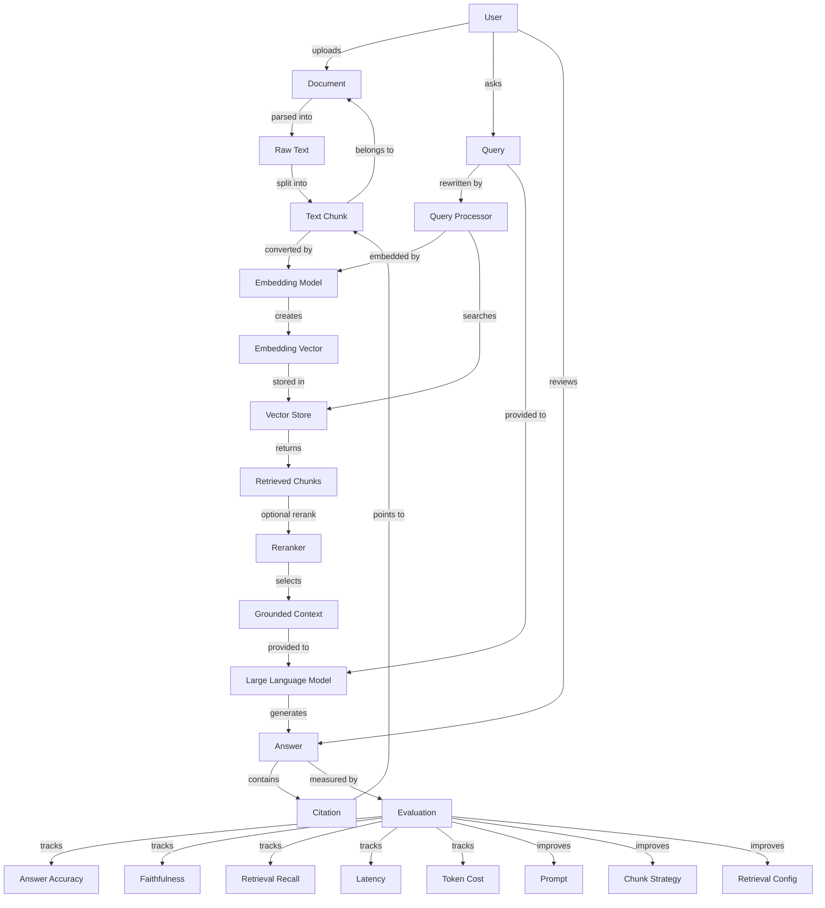
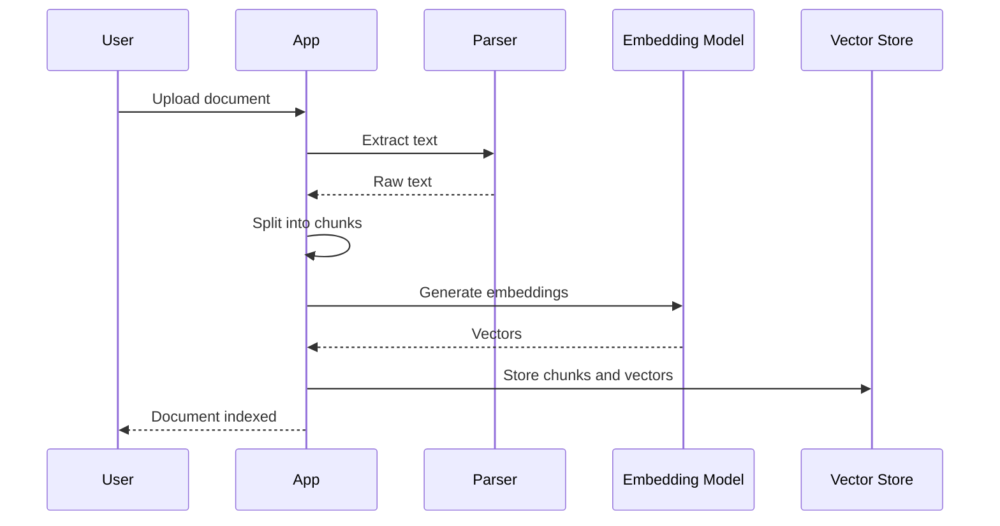
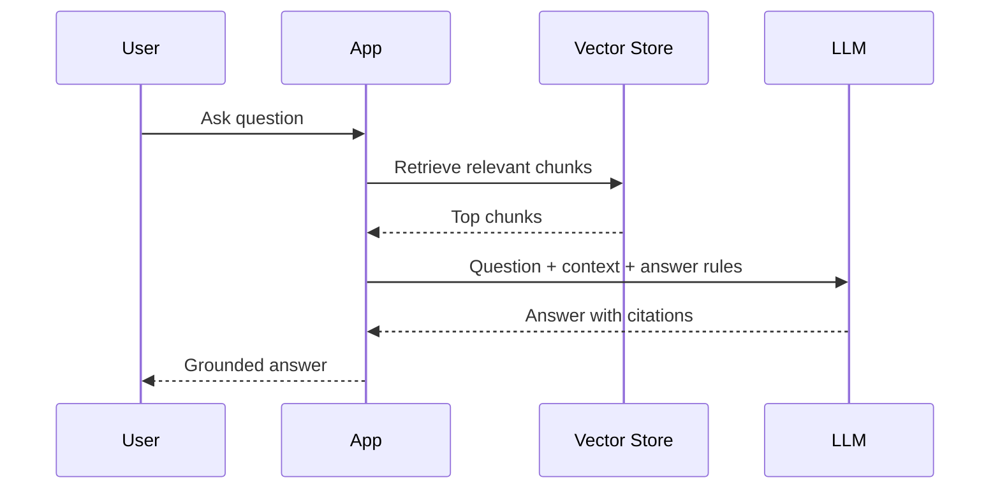
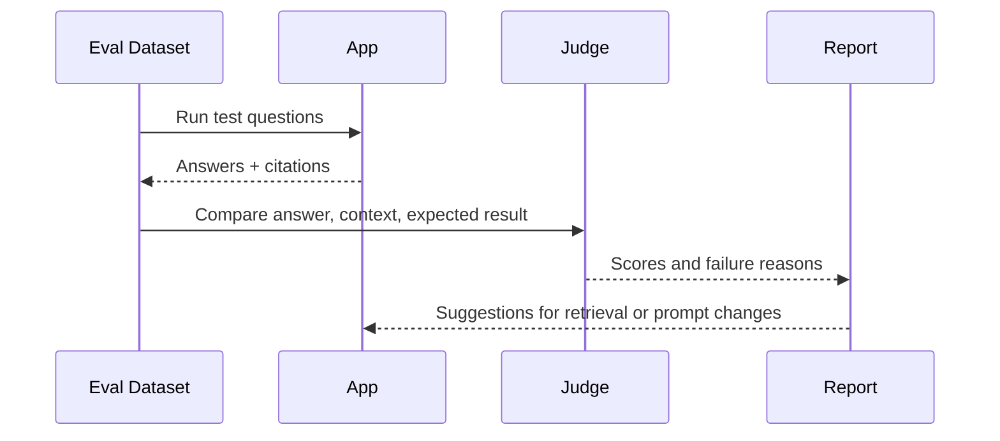
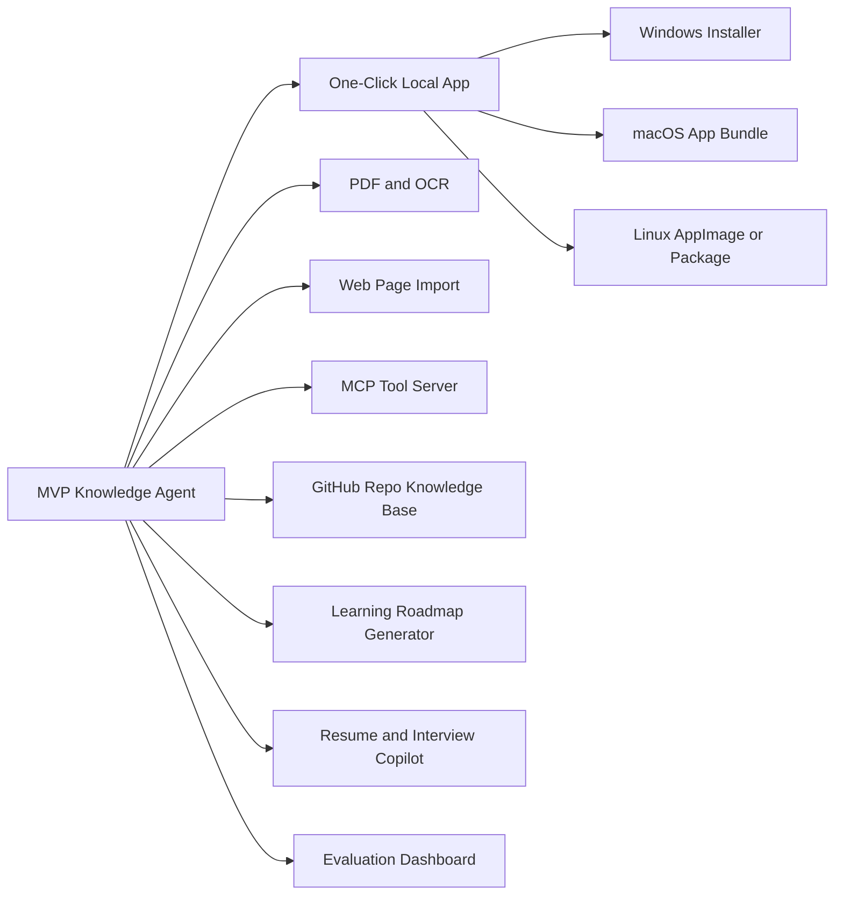

# AI Knowledge Agent Knowledge Graph

## Project Positioning

`AI Knowledge Agent` is a local-first personal knowledge-base assistant designed to become a packaged, one-click deployable desktop or local web application.

The first version focuses on:

- Importing local documents from a user-selected folder.
- Building a persistent searchable knowledge base on the user's machine.
- Answering questions with cited sources.
- Providing a simple local UI or CLI that non-developers can run.
- Keeping configuration, data, logs, and indexes inside predictable local directories.
- Supporting a future one-click packaging path for Windows/macOS/Linux.
- Evaluating answer quality with a small benchmark set.

## Core Knowledge Graph

## Product Entities

| Entity | Meaning | MVP Fields |
| --- | --- | --- |
| User | The person using the product | id, name |
| Document | Uploaded source file | id, filename, type, created_at |
| RawText | Extracted text from a document | document_id, text |
| Chunk | Searchable text segment | id, document_id, content, page, index |
| Embedding | Vector representation of a chunk | chunk_id, vector, model |
| Query | User question | id, text, created_at |
| RetrievalResult | Matched chunks for a query | query_id, chunk_id, score |
| Answer | Generated model response | id, query_id, content, citations |
| EvalCase | A test question with expected evidence | question, expected_answer, source_doc |
| EvalRun | A batch evaluation result | config, metrics, created_at |

## Technical Concepts

| Concept | Why It Matters |
| --- | --- |
| Document parsing | Converts PDF, Markdown, TXT, and web pages into text. |
| Chunking | Controls retrieval quality. Bad chunks cause bad answers. |
| Embeddings | Converts text into semantic vectors for similarity search. |
| Vector search | Finds relevant knowledge without exact keyword matching. |
| Reranking | Improves result ordering after the first retrieval pass. |
| Grounded generation | Forces the model to answer from retrieved context. |
| Citation | Makes answers inspectable and more trustworthy. |
| Evaluation | Turns the project from a demo into an engineering system. |
| Observability | Tracks latency, token usage, and failure cases. |

## Main Workflows

### 1. Ingestion Flow

### 2. Question Answering Flow

### 3. Evaluation Flow

## MVP Boundaries

### In Scope

- Import `.md` and `.txt` files from local folders.
- Parse and chunk text.
- Generate embeddings.
- Store chunks in a persistent local vector database.
- Ask questions against indexed documents.
- Return answers with source citations.
- Provide a local user-facing interface:
  - CLI for fast iteration.
  - Local web UI or desktop shell for packaged releases.
- Maintain user data under predictable local paths:
  - source documents
  - generated indexes
  - application config
  - logs
  - evaluation results
- Support environment-based model/provider configuration.
- Provide startup scripts for local development and packaged usage.
- Maintain a small evaluation dataset in JSON or YAML.
- Show basic eval metrics in the CLI or local UI.

### Packaging Requirements

- The app should be runnable by non-developers without manual Python/Node setup after packaging.
- The packaged app should initialize required local directories automatically on first launch.
- The app should preserve user data across upgrades.
- The app should expose clear controls for:
  - choosing document folders
  - rebuilding the index
  - asking questions
  - viewing citations
  - viewing logs or diagnostics
- Secrets and API keys must be stored outside source-controlled files.
- Packaging should target Windows first, then macOS/Linux if needed.

### Out of Scope For MVP

- Multi-user authentication.
- Real-time collaboration.
- Fine-tuning.
- Complex PDF table extraction.
- Browser automation.
- Enterprise permission system.
- Full observability stack.
- Cloud deployment as the primary runtime.

## Resume Value Map

| Capability | How This Project Demonstrates It |
| --- | --- |
| RAG engineering | Implements parsing, chunking, embeddings, retrieval, and grounded answers. |
| LLM application design | Uses structured prompts, citations, and failure handling. |
| Evaluation mindset | Measures quality instead of relying on manual inspection only. |
| Full-stack delivery | Can expose ingestion, search, answer, and eval flows through a UI. |
| Local software packaging | Demonstrates packaging an AI app into a user-runnable local product. |
| Product thinking | Solves a clear personal knowledge-management problem with a realistic distribution path. |

## Future Expansion Graph

